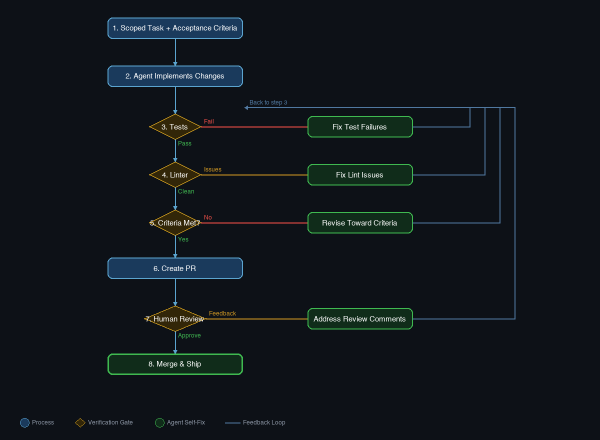

I've been coaching engineering teams on coding agents for a while now, and I keep hearing the same conversation. "We tried Claude Code, but the output was inconsistent." "We're thinking about upgrading to a bigger model." "Maybe we should wait for the next generation."

Every time, my response is the same: your model isn't the problem. Your workflow is.

## The Number That Changed My Mind

I used to think model quality was the primary lever too. Then I looked at the [SWE-bench data](https://openai.com/index/introducing-swe-bench-verified/) more carefully. When researchers first ran GPT-4 through SWE-bench Lite, performance ranged from 2.7% with a basic RAG scaffold to 28.3% with the CodeR scaffold. Same model. Same benchmark. **A 10x difference from scaffolding alone.** That pattern has only gotten more pronounced as models have improved: the gap between a bare prompt and a well-scaffolded workflow keeps widening.

That number rewired how I think about coding agents. When your workflow can swing performance by an order of magnitude, obsessing over which model to use is like tuning your engine while driving on flat tires.

## Where I Got This Wrong

Here's what actually happened. When I first started setting up coding agents, I let the agent write its own instruction files. It seemed efficient: who better to write the rules than the thing following them?

The results were bloated every time. Pages of instructions that restated things the model would already infer. Style guides that described defaults. Boundaries that were obvious. The instruction file looked thorough, but it was burning context window on information the agent already knew. Worse, the actually important rules got buried in noise.

I was optimizing the wrong layer entirely. The moment I started writing concise, opinionated instruction files myself, focused on the things the model *couldn't* infer (my specific commands, my repo's quirks, my actual boundaries), the same model started producing work I could actually ship.

## What the Data Actually Shows

This isn't just my experience. The evidence is piling up from multiple directions.

[GitHub analyzed over 2,500 repositories](https://github.blog/ai-and-ml/github-copilot/how-to-write-a-great-agents-md-lessons-from-over-2500-repositories/) with agents.md files and found a clear split. The repos getting consistent results shared specific traits: executable commands with exact flags, real code examples instead of prose descriptions, explicit three-tier boundaries (always do, ask first, never touch), and coverage across six areas: commands, testing, project structure, code style, git workflow, and boundaries.

The repos getting inconsistent results? Vague instruction files that read more like wish lists than operating manuals.

[Anthropic's context engineering research](https://www.anthropic.com/engineering/effective-context-engineering-for-ai-agents) reinforces the same point from a different angle. Context is a finite resource with diminishing returns. As the context window fills, attention degrades. Every token your agent spends figuring out your build system, discovering dependencies through trial and error, or reading files it doesn't need is a token not spent on the actual task.

The research on verification loops is equally compelling. Early foundational work like [Self-Refine](https://arxiv.org/abs/2303.17651) showed roughly 20% average improvement from iterative self-feedback, and [Reflexion](https://arxiv.org/abs/2303.11366) hit 91% pass@1 on HumanEval with verbal self-reflection compared to 80% without. Those numbers were measured on earlier models, but the core pattern holds: agents that check and correct their own work consistently outperform those that don't, regardless of which model is underneath.

## Five Scaffolding Changes You Can Make This Week

These aren't theoretical. I coach teams on these specific changes, and every one of them produces visible improvement within days.

### 1. Write an Operating Manual, Not a Wish List

Your CLAUDE.md or agents.md should be executable documentation. Put your build, test, and lint commands at the top with exact flags. Show one real code snippet that demonstrates your style instead of writing three paragraphs describing it. Include three-tier boundaries: what the agent should always do, what it should ask about first, and what it should never touch.

The [GitHub analysis](https://github.blog/ai-and-ml/github-copilot/how-to-write-a-great-agents-md-lessons-from-over-2500-repositories/) found that for every instruction, you should ask: "Would removing this cause the agent to make mistakes?" If the answer is no, cut it. Bloated instruction files cause agents to ignore the rules that actually matter.

### 2. Add Verification Loops Before You Add Anything Else

This is the single highest-leverage change. Tell your agent to run tests after making changes. Include linting in the workflow. For UI work, add screenshot comparison. Provide expected output or acceptance criteria in every task.

Most teams I work with skip this entirely. Their agents produce plausible-looking code that compiles but doesn't handle edge cases. Adding "run the tests and fix any failures before marking this complete" to your agent instructions costs you nothing and catches the majority of silent failures.

### 3. Scope Tasks with Acceptance Criteria

Treat every issue you assign to an agent like a prompt. Include the symptom, the likely file location, and a concrete definition of "done." [OpenHands recommends](https://docs.openhands.dev/openhands/usage/tips/prompting-best-practices) keeping agent tasks under roughly 100 lines of code changes.

This sounds obvious, but I watch teams hand agents vague tickets like "improve the error handling" and then wonder why the output is unfocused. An agent task that says "in src/api/auth.ts, the login function throws a raw error on line 47; wrap it in our AppError class and add a test case that verifies the error code is AUTH_FAILED" will outperform "fix the auth errors" every single time.

### 4. Pre-Install Dependencies and Standardize the Environment

[GitHub's Copilot coding agent docs](https://docs.github.com/en/copilot/tutorials/coding-agent/get-the-best-results) describe what happens when agents work without environment setup: they discover and install dependencies through trial and error, which is slow and unreliable. Every turn your agent spends running `npm install` and hitting errors is a turn it's not spending on your actual task.

Create a setup file. Document your environment variables. Provide the exact commands the agent needs. Reduce the cold start so tokens go to real work.

### 5. Use the PR Feedback Loop as a Steering Mechanism

Don't review agent PRs in one shot. Batch your comments using "Start a Review" rather than single comments, then submit them all at once. This gives the agent a complete picture of your feedback instead of a trickle of isolated corrections.

Track your PR merge rates over time. The percentage of agent PRs that ship without manual fixes is the clearest signal of whether your scaffolding is improving.

## The Uncomfortable Implication

If scaffolding matters 10x more than model selection, then the teams getting the best results aren't the ones with the biggest AI budgets. They're the ones with the most disciplined engineering practices.

That's actually good news. You don't need to wait for the next model release or negotiate a bigger API spend. You can start improving your coding agent's output today, with changes that take hours, not quarters.

The five changes above are where I'd start. Pick one, implement it this week, and measure the difference. I think you'll find that your "underperforming" model has been capable of much more all along. It just needed a better workflow to show it.
