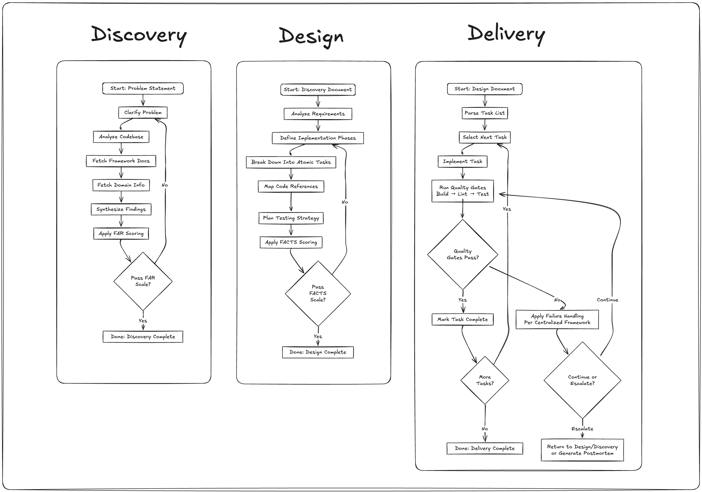

Imagine an AI coding assistant that never hallucinates, stays focused on exactly what you need, and produces code that actually works the first time. Sound impossible? It's not—you just need the right framework.

The 3D Strategy is a battle-tested framework that transforms chaotic AI interactions into predictable, high-quality software delivery. It's the difference between hoping your AI assistant understands you and knowing it will deliver exactly what you need.

## Why Most AI Development Fails

Here's what typically happens: You ask an AI to build a feature. It generates 500 lines of code using libraries you don't have, inventing methods that don't exist, solving the wrong problem entirely. Sound familiar?

The issue isn't the AI—it's that we're asking it to read our minds. Without structure, even brilliant AI assistants become expensive random code generators.

## The 3D Strategy: Your AI Development GPS

Think of the 3D Strategy as turning your AI from an eager intern into a seasoned developer. How? By breaking work into three focused phases—Discovery, Design, and Delivery—each with built-in validation that ensures you're ready to proceed.

Here's the magic: The framework includes validation scales (FAR for Discovery, FACTS for Design) that score your work to ensure it's factual, actionable, and properly scoped. No more guessing if you're ready to move forward—the framework tells you.

### The Three Phases That Change Everything

**Discovery: Build Context & Insight**
You start by researching the problem thoroughly—gathering evidence, mapping code surfaces, validating findings. The FAR scale (Factual, Actionable, Relevant) ensures your discoveries are based on facts, not assumptions. No more building on shaky foundations.

**Design: Decide What to Do & How**
Here's where the magic happens: You break work into tasks under 4 hours each. Why 4 hours? Because that's the sweet spot where AI excels—big enough to be meaningful, small enough to stay focused. The FACTS scale validates that each task is Feasible, Atomic, Clear, Testable, and properly Sized.

**Delivery: Ship & Learn**
With validated context and properly sized tasks, your AI becomes unstoppable. It executes each task systematically, with continuous validation through builds, tests, and lints. You stay in control of decisions while AI handles the implementation.

## A Real Example

Let's say you receive a new ticket: "Add ability for users to bulk delete their uploaded files."

**Discovery**: Instead of guessing requirements, your AI uses "Reverse Prompting"—asking you clarifying questions one at a time. "Should this work from the file manager or dashboard?" "Any file type restrictions?" "What happens to shared files?" After the Q&A reveals insights you hadn't considered, the AI analyzes your codebase and documentation, then outputs a discovery markdown file. The FAR scale validates these findings are factual (based on actual code), actionable (you know exactly what to build), and relevant (solves the real user need).

**Design**: Using the discovery doc in a fresh context, your AI analyzes requirements and creates a phased approach with atomic tasks with markdown checkboxes. Phase 1: "Add bulk selection UI to file manager." Phase 2: "Create delete confirmation modal with file count." Phase 3: "Implement backend bulk delete API." Each phase passes FACTS validation to ensure it's feasible and properly scoped.

**Delivery**: With your design doc loaded in fresh context, your AI iterates through tasks systematically. You choose your feedback loop: "Do a task, validate" for maximum control, "Do a phase, validate" for speed, or "Do the whole thing, validate" when you're confident. Quality gates—tests, builds, lints—must pass after each task. No hallucinations, no scope creep—just focused execution that works.

## Why This Actually Works

The secret is in what we don't let AI do: make big decisions without validation. Instead, we use AI's strengths—pattern matching, code generation, systematic execution—while humans handle strategy and validation.

Those validation scales aren't just checkboxes. They're guardrails that prevent the most common AI failures:
- **Context overflow?** Eliminated by keeping tasks atomic (i.e. a command call, file edit)
- **Hallucination?** Prevented by [FAR](https://github.com/patrob/3d-strategy/blob/main/docs/scales/far-scale.md) validation requiring factual evidence
- **Wrong problem solved?** Impossible when Discovery validates relevance first
- **Untestable code?** [FACTS](https://github.com/patrob/3d-strategy/blob/main/docs/scales/facts-scale.md) validation ensures plan has clear success criteria

## Start Using It Today

The 3D Strategy works with whatever AI tools you're already using—Claude, GitHub Copilot, Cursor. It's not about new tools; it's about directing them properly.

Teams are experimenting with 3D and taming AI, because their AI assistants finally understand exactly what's needed.

## Your Next Step

Pick a bug or small feature you're working on. Try one Discovery → Design → Delivery cycle. It won't take long, and you'll immediately see the difference.

**Ready to dive deeper?**
- See the validation scales that make this work: [FAR Scale](https://github.com/patrob/3d-strategy/blob/main/docs/scales/far-scale.md) & [FACTS Scale](https://github.com/patrob/3d-strategy/blob/main/docs/scales/facts-scale.md)
- Walk through each phase: [Discovery](https://github.com/patrob/3d-strategy/blob/main/docs/phases/discovery.md), [Design](https://github.com/patrob/3d-strategy/blob/main/docs/phases/design.md), [Delivery](https://github.com/patrob/3d-strategy/blob/main/docs/phases/delivery.md)
- Get started now: [Quick Start Guide](https://github.com/patrob/3d-strategy#quick-start)

The future isn't about AI replacing developers—it's about developers who know how to direct AI replacing those who don't. The 3D Strategy gives you that superpower.